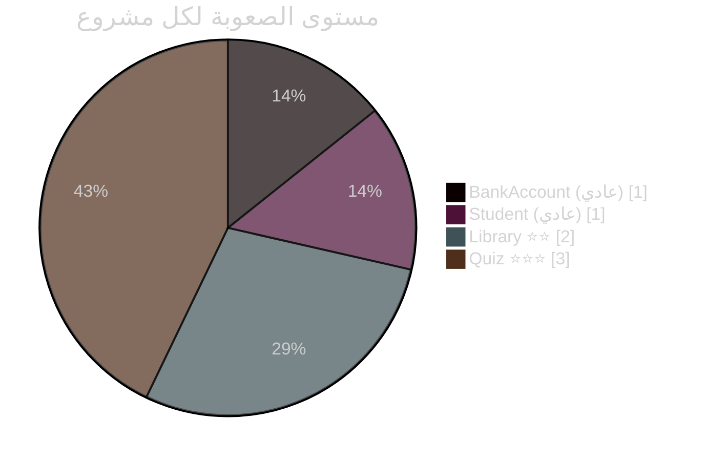
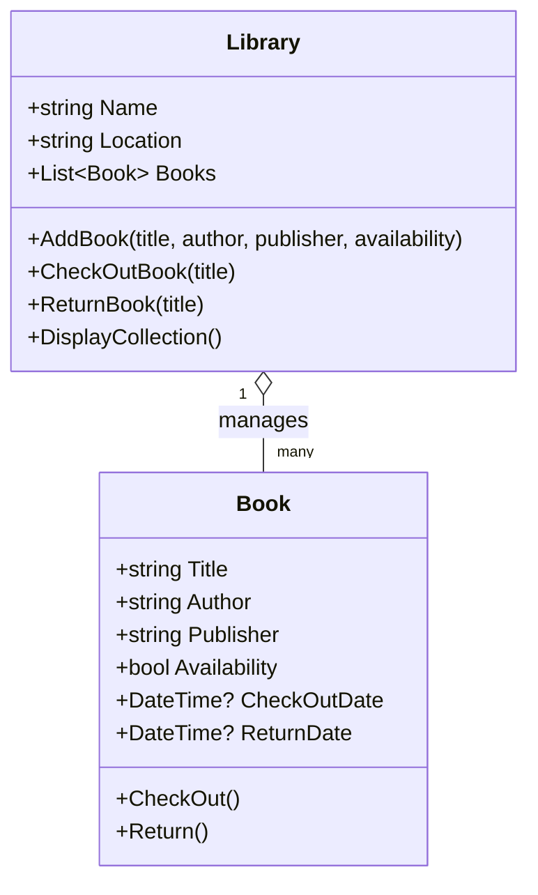
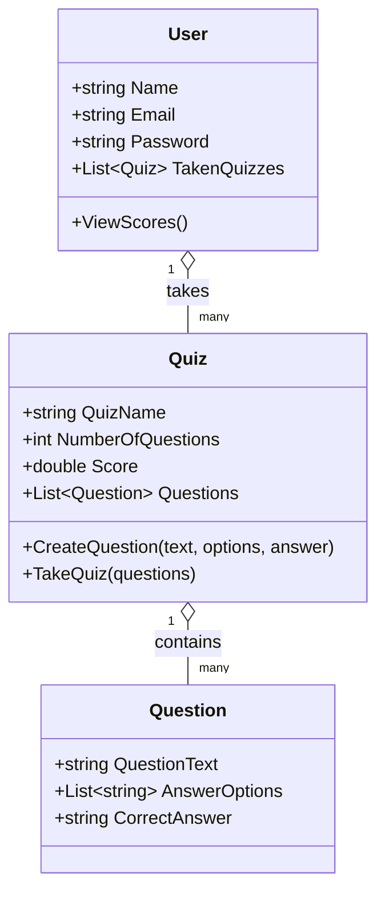
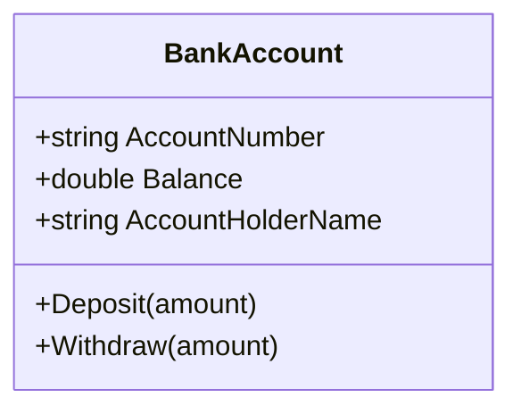
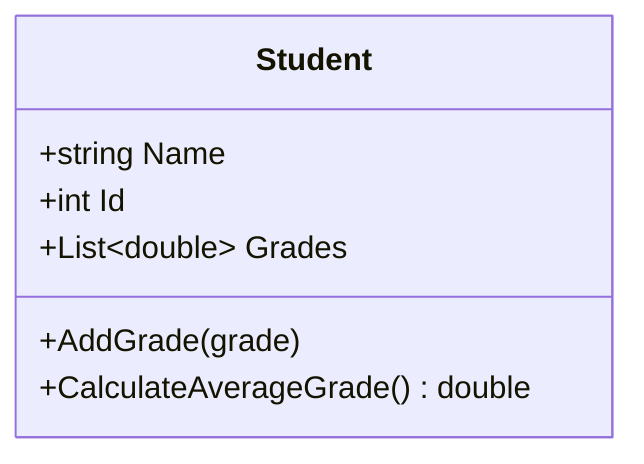
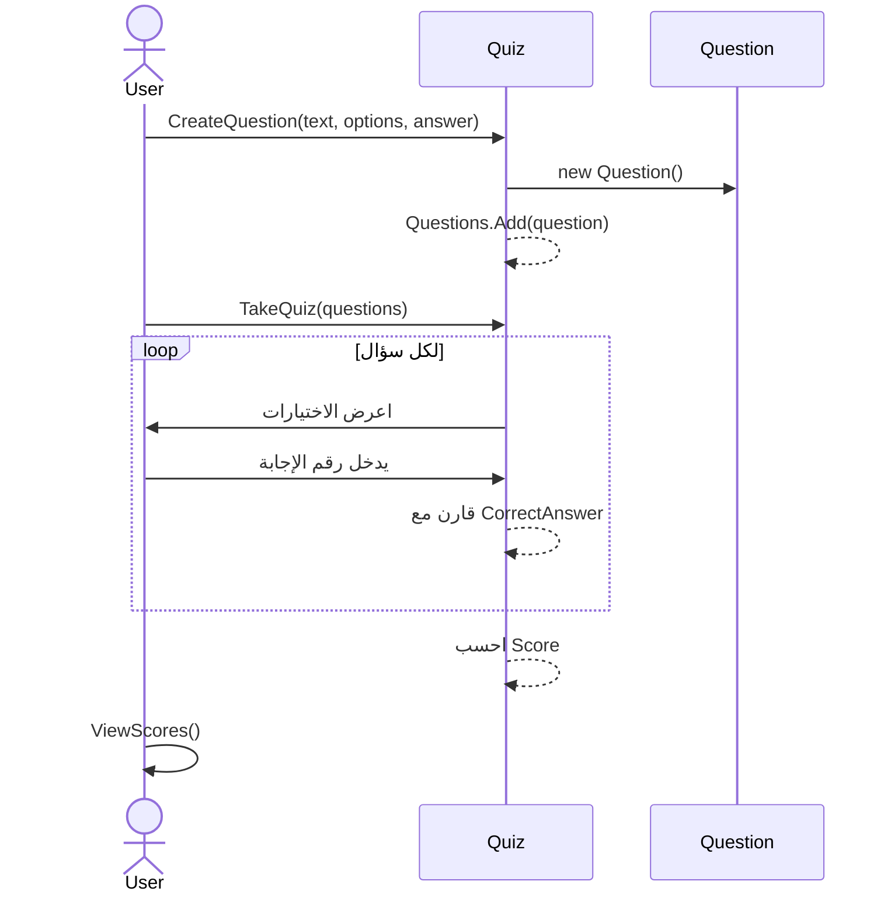
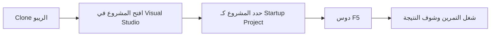

[README (8).md](https://github.com/user-attachments/files/31052998/README.8.md)
<div align="center">


<br/>


[]()

<br/>


</div>

<div align="center">
  <a href="#-بيانات-المشروع">البيانات</a> •
  <a href="#-عن-المشروع">عن المشروع</a> •
  <a href="#️-المشاريع-الأربعة">المشاريع</a> •
  <a href="#-مخططات-الكلاسات">مخططات الكلاسات</a> •
  <a href="#-إزاي-تشغل-المشاريع">التشغيل</a> •
  <a href="#-هيكل-الريبو">الهيكل</a>
</div>

---

## 👤 بيانات المشروع

<div align="center">

| | |
|---|---|
| **تنفيذ الطالب** | حمزة أحمد حسن إسماعيل علي |
| **تحت إشراف** | د. علي علي سطوحي |
| **المادة** | Object Oriented Programming |
| **التمرين** | Exercises 2 — Classes Assignment |

</div>

---

## 📋 عن المشروع

الريبو ده فيه حل تمارين الـ OOP بتاعة الـ Classes Assignment، أربع مشاريع كل واحد فيهم بيطبق فكرة مختلفة من مبادئ البرمجة الكائنية بلغة **C# (.NET)**، الكود كله كونسول أبلكيشن، من غير أي مكتبات خارجية.

<div align="center">



</div>

---

## 🗂️ المشاريع الأربعة

<table>
<tr>
<td width="50%" valign="top">

### 🏦 1. BankAccountProject
برنامج بسيط بيمثل حساب بنكي، بيسمح بالإيداع والسحب مع حماية إن السحب ميعديش الرصيد.

**الكلاس:** `BankAccount`
- Properties: `AccountNumber`, `Balance`, `AccountHolderName`
- Methods: `Deposit()`, `Withdraw()`

</td>
<td width="50%" valign="top">

### 🎓 2. StudentProject
برنامج بيدير درجات طالب في الامتحانات وبيحسب المتوسط بتاعه.

**الكلاس:** `Student`
- Properties: `Name`, `Id`, `Grades`
- Methods: `AddGrade()`, `CalculateAverageGrade()`

</td>
</tr>
<tr>
<td width="50%" valign="top">

### 📚 3. BookProject `⭐⭐`
نظام مكتبة بسيط، بيسمح بإضافة كتب واستعارتها وإرجاعها مع تسجيل التواريخ.

**الكلاسات:** `Book`, `Library`
- Methods: `AddBook()`, `CheckOutBook()`, `ReturnBook()`, `CheckOut()`, `Return()`

</td>
<td width="50%" valign="top">

### 🧠 4. QuizProject `⭐⭐⭐`
تطبيق كويز أونلاين، المستخدم بياخد اختبار اختيار من متعدد وبتتحسب درجته أوتوماتيك.

**الكلاسات:** `User`, `Quiz`, `Question`
- Methods: `CreateQuestion()`, `TakeQuiz()`, `ViewScores()`

</td>
</tr>
</table>

---

## 🧩 مخططات الكلاسات

مخططات UML حقيقية بتوضح الـ properties والـ methods والعلاقات بين الكلاسات في كل مشروع (GitHub بيرندرها تلقائي كـ diagram تفاعلي قابل للتكبير).

<details>
<summary><b>📚 مخطط BookProject — العلاقة بين Library و Book</b></summary>



</details>

<details>
<summary><b>🧠 مخطط QuizProject — العلاقة بين User و Quiz و Question</b></summary>



</details>

<details>
<summary><b>🏦 مخطط BankAccountProject</b></summary>



</details>

<details>
<summary><b>🎓 مخطط StudentProject</b></summary>



</details>

---

## 🔄 السيناريو التنفيذي (QuizProject)



---

## 🛠️ الأدوات المستخدمة

<div align="center">

</div>

---

## 🚀 إزاي تشغل المشاريع

<details>
<summary><b>دوس هنا عشان تشوف خطوات التشغيل خطوة بخطوة</b></summary>

<br/>



1. اعمل clone للريبو
   ```bash
   git clone https://github.com/hamza-ahmed26/OOP-Exercises-2.git
   ```
2. افتح المشروع اللي عايزه في **Visual Studio**.
3. حدد المشروع كـ **Startup Project**.
4. دوس `F5` أو زرار **Run** ▶️.

</details>

---

## 📂 هيكل الريبو

```
OOP-Exercises-2/
├── BankAccountProject/
│   ├── BankAccount.cs
│   └── Program.cs
├── StudentProject/
│   ├── Student.cs
│   └── Program.cs
├── BookProject/
│   ├── Book.cs
│   ├── Library.cs
│   └── Program.cs
├── QuizProject/
│   ├── Question.cs
│   ├── Quiz.cs
│   ├── User.cs
│   └── Program.cs
└── README.md
```

---

## ✨ مبادئ الـ OOP المطبقة

<div align="center">

| المبدأ | فين اتطبق |
|:---|:---|
| **Encapsulation** | كل الـ properties بـ private set ومتاحة بس عن طريق الـ public getters |
| **Constructors** | كل كلاس بيبدأ حالته من خلال constructor مخصص له |
| **Collections** | استخدام `List<T>` في الدرجات والكتب والأسئلة والكويزات |
| **Class Collaboration** | `Library` بتدير `Book`، `Quiz` بتدير `Question`، `User` بيتابع `Quiz` |
| **Input Validation** | التحقق قبل التنفيذ (زي عدم كفاية الرصيد أو الكتاب متسحب أصلاً) |

</div>

---

<div align="center">


**تسليم مادة Object Oriented Programming — تحت إشراف د. علي علي سطوحي**

</div>
